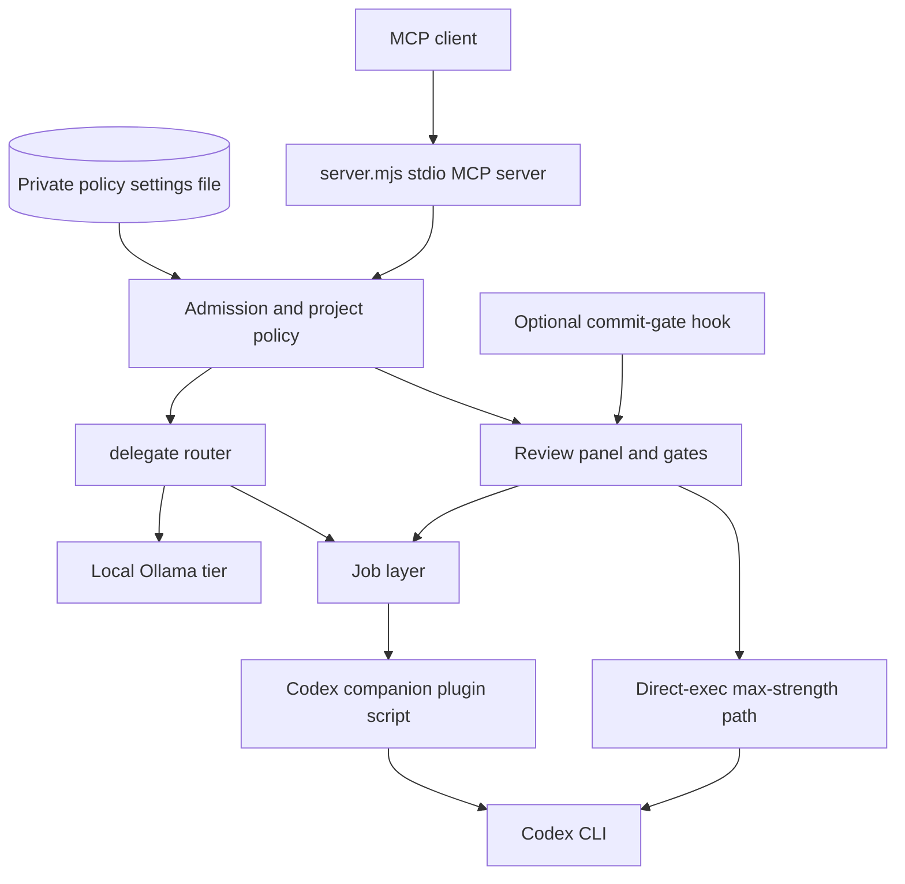

# Codex MCP router and review gate

[](https://github.com/johnaadams122/codex-review-mcp/actions/workflows/ci.yml)

A Windows stdio MCP server that routes coding and review work from an MCP client to the OpenAI Codex command-line tool, under a per-project policy that decides what each folder may do.

It registers eleven tools: background Codex tasks and code reviews (`codex_task`, `codex_review`, `codex_adversarial_review`); a synchronous multi-lens review panel (`codex_review_panel`) and phase gates for specs, plans and implementations (`codex_gate`), both of which return a fail-closed consensus verdict; job control (`codex_status`, `codex_result`, `codex_wait`, `codex_list_jobs`, `codex_cancel`); and `delegate`, which sends a task to a local Ollama model, to Codex, or back to the calling model.

Folders that your policy file does not list are treated as unknown and sensitive: Codex may read them for a task but never write, and reviews are refused. A folder belongs to a project when it is that project's folder (`projectsBase` plus `dir`) or is inside it. Locations are compared after the operating system resolves junctions, links and short names, so a link inside a project gets the policy of the folder it points to. Folders that cannot be matched safely are treated as unknown too: relative paths, network shares other than the one that holds `projectsBase`, device paths, broken links, names Windows could read two ways, a project folder that is itself a link, and a folder claimed by two project rows. Secret-shaped strings (API keys, bearer tokens, passwords) are redacted from task text and context before they reach Codex. An optional max-strength path runs reviews through the Codex CLI directly, with an operating-system read-only sandbox and a receipt of the model strength actually used; `codex_review_panel` and `codex_gate` use it when their `strength` argument is the max pair defined as `MAX_STRENGTH` in `routing.mjs` (`{ "model": "gpt-6-astra", "effort": "max" }`).

## Architecture



## Setup

Requirements:

- Windows (developed on Windows 11; CI runs on Windows Server 2022). The process-kill and process-check code calls `taskkill` and `powershell.exe`; there is no Linux or macOS support.
- Node.js 22.3 or newer (CI uses Node 24). `npm test` passes `--experimental-test-module-mocks`; `package.json` still declares `>=18`, which has not been tested.
- The Codex command-line tool, signed in with your own account. The max-strength path starts it directly, which on Windows needs a real `codex.exe`: an npm install puts only a shell script and a `.cmd` file on PATH, which the server does not use, so then set `CODEX_BIN` to the `codex.exe` in the npm package's vendor folder.
- OpenAI's Codex plugin for Claude Code (the `openai/codex-plugin-cc` repository on GitHub), which provides the companion script: point `CLAUDE_PLUGIN_ROOT` at its `codex` plugin folder, the one that contains `scripts/codex-companion.mjs`. This repository does not include or download it. Without it, every tool that starts or reads a Codex job through the companion fails with `companion_plugin_root_unset`; `delegate` on the local tier does not need it.
- Ollama with a model such as `qwen2.5:7b`, only for the local tier.

```powershell
npm ci --ignore-scripts --no-audit --no-fund
$env:CLAUDE_PLUGIN_ROOT = '<folder that contains scripts\codex-companion.mjs>'
node server.mjs
```

Register `node <path to server.mjs>` as a stdio server in your MCP client, with `CLAUDE_PLUGIN_ROOT` (or `companionPluginRoot` in the policy file, below) in its environment.

**Project policy file.** The policy lives in a private JSON file, never in this repository. The server reads the path in `CODEX_MCP_POLICY_FILE`, or `~/.codex-mcp/project-policy.json` when that variable is unset, once on first use; a change needs a restart. The file is limited to 1 MiB and every unknown key is refused:

```json
{
  "schema": "codex-mcp-project-policy-v1",
  "projectsBase": "<absolute folder that holds your projects>",
  "projects": [
    { "dir": "<folder name>", "name": "<snake_case id>", "write": true, "git": true, "pii": false, "review": true }
  ],
  "gateAllowlist": ["<project name>"],
  "companionPluginRoot": "<absolute folder>",
  "reaperExtraRoots": ["<absolute folder>"]
}
```

`write`, `git` and `pii` are required for each project; `review` is optional and defaults to the opposite of `pii`. `write` lets Codex tasks change files there (otherwise they run read-only and report `write_blocked`); `git` is needed for reviews of a git diff (`codex_review`, `codex_adversarial_review`, `codex_review_panel` and the `impl` gate); `pii` marks the folder sensitive: job listings show no prompt text, a `delegate` write request is handed back to the caller, the automatic gate skips it, and reviews through the companion are off unless `review` is `true`. The max-strength path still reviews a `pii` folder read-only whatever its `review` flag, and refuses a non-`pii` folder whose row sets `review: false`. `gateAllowlist`, `companionPluginRoot` and `reaperExtraRoots` are optional and default to empty. Every path in the file must be a full absolute path in its plain form: on Windows a drive letter or network share with backslashes only (written `C:\\Work` in JSON), no trailing backslash, no `.` or `..` parts and no long-path or device prefix. Each `dir` is one plain folder name that Windows reads only one way (no trailing dot or space, no device name such as `CON`, no `~` followed by a digit, no characters Windows refuses), and no two `dir` values may differ only in letter case. Each `name` uses lowercase letters, digits and underscores and cannot be `unknown`; every `gateAllowlist` entry must be the `name` of a project row. `CODEX_MCP_POLICY_FILE` must itself be a full absolute path. `reaperExtraRoots` (or the `CODEX_MCP_REAPER_EXTRA_ROOTS` variable) lists further repositories that `tools/gate-reaper.mjs` checks for automatic gate runs that stopped without finishing; run that tool on a schedule if you turn on the automatic gate. The companion folder comes from a non-empty `CLAUDE_PLUGIN_ROOT` first, then from `companionPluginRoot`; there is no built-in default.

**Fail-safe default.** A missing or invalid file never stops the server. It writes one reason code (never the file's contents) to stderr and treats every folder as an unknown, sensitive project: no writes and no reviews. Any validation error rejects the whole file, including `companionPluginRoot`.

Optional environment variables, all read by the server process (the panel timeout and the two payload caps are read once at start, so a change needs a restart): `CODEX_COMPANION_TIMEOUT_MS` (300000) and `CODEX_CONTROL_TIMEOUT_MS` (30000) bound companion calls; `CODEX_PANEL_TIMEOUT_MS` (1800000, clamped to 60000 through 7200000) bounds a review panel's wait; `CODEX_DIRECT_TIMEOUT_MS` (1200000, same clamp) does the same for the max-strength path; `CODEX_PANEL_DIFF_CAP` and `CODEX_GATE_CAP` (200000 each) cap review payloads; `CODEX_MCP_LOCAL_MODEL` and `CODEX_MCP_LOCAL_THINK` select the local model and its thinking flag; `CODEX_BIN` names the Codex CLI program for the max-strength path (default: the first `codex.exe` or `codex.com` on PATH), and `CODEX_HOME` names the Codex home folder that holds its sign-in and session files (default `~/.codex`); `CODEX_MCP_OWNER_CWD` names the folder whose jobs the server can still read after a restart (default: its own working folder).

**Command line.** `node cli.mjs delegate "<task>" [--tier=auto] [--quality=...] [--write] [--wait]` and `node cli.mjs gate --phase=spec --target=SPEC.md` run the same code without an MCP client.

**Optional automatic gate.** `hooks/hooks.json` is a Claude Code hook file that registers `hooks/gate-surface.mjs` for the `PostToolUse` and `Stop` events, and `hooks/post-commit-shim.sh` is meant to be copied to a repository's `.git/hooks/post-commit` (Git for Windows runs hook scripts with its own `sh`); both contain the placeholder `<CODEX_MCP>`, which you replace with this folder's path. A repository takes part only if it has a `.codex-autogate` file at its root and its project name is in `gateAllowlist`, which is empty by default, so nothing is gated until you opt in. A separate edit hook, `hooks/gate-due.mjs`, is not in `hooks.json`; if you register it yourself as a post-tool hook, it reacts only when a Write or Edit tool changes a Markdown file directly inside the design-document `specs` or `plans` folder that `hooks/gate-due.mjs` names, below the folder that holds `.codex-autogate`, and it only records a reminder to run a gate (it starts no review and does not need `gateAllowlist`). Setting `CODEX_AUTOGATE=off` disables the automatic gate. The hooks are advisory: they exit 0 and only surface a one-line verdict.

## Synthetic example

A synthetic policy and four calls, shown as tool calls and abbreviated results:

```text
project-policy.json
  { "schema": "codex-mcp-project-policy-v1", "projectsBase": "C:\\Work",
    "projects": [ { "dir": "demo-app", "name": "demo_app", "write": true, "git": true, "pii": false } ] }

delegate { "task": "Summarize: the build passed after two retries.", "quality": "local", "cwd": "C:/Work/demo-app" }
  -> selected_tier "local"; the model's text comes back inline (if Ollama is down, the call returns
     selected_tier "claude" (the calling model) with reason ollama_unavailable_fallback and the work is handed back to the caller)

codex_review { "cwd": "C:/Work/demo-app", "scope": "working-tree", "wait": true }
  -> a Codex code review of the working-tree diff on the default review model; the projected result carries job_id, status and output

codex_gate { "phase": "spec", "cwd": "C:/Work/demo-app", "target_files": ["SPEC.md"] }
  -> consensus_verdict "pass", "block" or "error", with each reviewer's findings and the strength that was used;
     a truncated payload, a missing target or a below-floor strength can never pass

codex_status { "job_id": "<job_id>", "cwd": "C:/Work/demo-app" }
  -> the job's status, for a task or review that was submitted without waiting
```

This illustrates the interface; reviewer output depends on the Codex models available to your account.

## Tests

```powershell
npm ci --ignore-scripts --no-audit --no-fund
npm test
```

`npm test` runs `node --experimental-test-module-mocks --test tests/*.mjs`. CI performs the same locked `npm ci` setup and then runs `node --test --test-concurrency=4 --test-timeout=180000` with all but ten of the `tests/*.test.mjs` files named explicitly, as declared in `.github/ci/portfolio-tests.json`. Ten of those files replace modules with `mock.module()` and so need `--experimental-test-module-mocks`, a flag the hosted CI runner does not pass; CI leaves them out, and `npm test` runs them.

The suite has been run on Windows only. It starts local fake stand-ins for the Codex companion and the Codex CLI and stubs the local model endpoint; it does not call Codex, Ollama or any other remote service.

The documented suite uses synthetic data and mocks external services. Dependency
installation may use public package registries; tests are reviewed to run offline.
The CI badge reports the hosted workflow's status for its selected commit.

## External services

The server holds no credentials, and its only model call of its own is the local tier's call to Ollama described below. Codex work goes through the Codex companion script and the Codex CLI, which use their own signed-in account; the max-strength path launches the CLI directly and hands it the folder named by `CODEX_HOME` (default `~/.codex`).

The server's own network code is limited to two places. The local tier posts to a local Ollama instance at the fixed address `http://localhost:11434/api/generate`, with a 120-second timeout and the model `qwen2.5:7b` unless `CODEX_MCP_LOCAL_MODEL` names another; when that call fails the result is tagged `ollama_unavailable_fallback` and the work is handed back to the caller. When the max-strength path checks its sandbox preconditions, the server process makes one HTTPS GET to `https://1.1.1.1` as a connectivity control: a request refused inside the sandbox counts as proof of network denial only if this GET succeeds, which shows the machine itself is online. Network denial is required only for folders marked `pii`; other folders need only the verified write denial. The check runs again only when its stored result does not cover the request (no result yet for the current Codex program, write denial not verified, or a `pii` folder without verified network denial); `tools/direct-preflight.mjs` makes the same request.

Locally, review logs go to a `codex-mcp-reviews` folder (old files are removed each time a review starts) and per-run folders of the max-strength path go to a `codex-direct` folder (swept every 15 minutes), both under the operating system's temp folder. The optional gate hooks keep a marker and a run journal in a `.superpowers` folder at the root of each opted-in repository. The list of jobs the server submitted is kept only in memory: after a restart it can still read jobs in its own working folder (or `CODEX_MCP_OWNER_CWD`), but not jobs it started in other folders. The companion plugin and the Codex CLI have their own network behavior, which this repository does not control.

## Limitations

Windows only. Job and process cleanup uses `taskkill`, process checks use Windows PowerShell, and the max-strength path accepts only the Codex CLI versions pinned in `direct.mjs` (0.144.1 and 0.160.1), the newer one run with the elevated Windows sandbox mode. That path needs the sandbox to be set up on your machine; `tools/direct-preflight.mjs` reports which requirement fails.

You must write the policy file. Without it the server is safe but nearly inert: nothing may be written and nothing may be reviewed. Treat the `pii` and `review` flags as your own labels; the server cannot tell what a folder contains. A drive letter is always treated as a local drive, even if it is mapped to a network share.

Reviews are advisory. The server returns a verdict and findings; it does not block a commit or merge anything, and reviewer output can be wrong. A spec or plan gate checks the document's internal quality (gaps, contradictions, ordering, missing tests) and cannot verify its claims against external code. Payloads over the cap are truncated, and a truncated review can never pass.

The default model names and effort levels in `routing.mjs` (a flagship tier, a standard tier, a cheaper fast tier, the same fast model at high effort for simple reviews, and a rarely used heaviest tier) are examples tied to one account; edit that table or pass `model` and `effort` yourself if your account differs. The tool descriptions in `server.mjs` name the default models in their text, so they go out of date if you edit the table and not them. Which models exist, what they cost and what your plan allows are outside this repository.

The review panel's three lenses (correctness, security and privacy, design simplicity) and the gate's phase lenses are prompts; they steer the reviewer and do not guarantee coverage. Secret redaction uses a short list of key, bearer-token, password and token patterns and does not find every secret.

Automatic gating, if you enable it, is budgeted to 20 reviewer jobs a day by default.

The max-strength path cannot parse a diff header in which git quotes the second path but not the first (as it does for a rename from a plain to a non-ASCII file name), so it refuses that change with `payload_parse_error`; it never passes it unread. `codex_task` and Codex-tier `delegate` hand the prompt and `context_snapshot` to the companion on its command line, so together they must stay under the Windows command-line limit of about 32,000 characters; a longer request fails to start.

The offline tests use fakes and do not prove live Codex or Ollama behavior. The software is provided as is, without warranty, under the MIT License.

## How this was built

The project owner designed the architecture, wrote specifications, directed AI coding agents,
and used AI reviewers plus his own review of designs, plans and results. The code
was developed with AI assistance and review gates.

## License and security

MIT. See [LICENSE](LICENSE) and [SECURITY.md](SECURITY.md).
